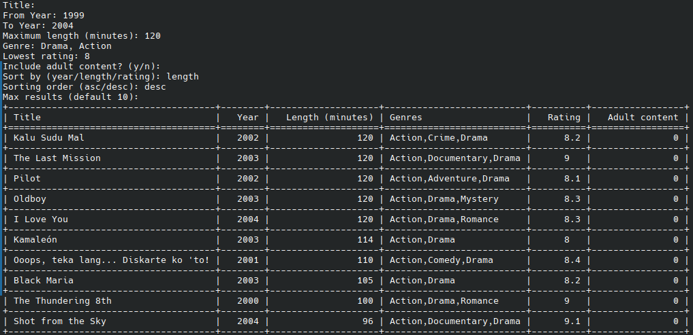

# 🎬 Movie Exploration System (PostgreSQL + Python CLI)

A simple yet powerful command-line application for exploring IMDB movie data using **PostgreSQL**.  
The project demonstrates **SQL data modeling**, **joins**, **filtering**, and **query optimization** on a real-world dataset of over one million movies.

---

## 🚀 Features

- Explore movies by title, genre, length, rating and year range  
- Sort results dynamically by rating, release year or length
- Fetch top-rated movies or movies within a specific time frame  
- Secure, parameterized queries to prevent SQL injection  
- Lightweight Python CLI interface  

---

## 🧩 About the Project

This project was created as a hands-on exercise in:
- Data modeling and normalization in PostgreSQL  
- Writing optimized and safe SQL queries  
- Integrating a Python CLI interface with a relational database  

It uses cleaned IMDB datasets (not included due to file size limits).  
You can download them from [IMDB datasets](https://datasets.imdbws.com/).

---

## 🧱 Project Structure

```plaintext
cinemadb/
│
├── app/
│   ├── main.py            # CLI interface
│   ├── db.py              # PostgreSQL connection setup
│   ├── queries.py         # SQL queries and dynamic filters
│
├── data/
│   ├── check_title.basics.py   # Validates and cleans title.basics.tsv
│   ├── null.py                 # Converts values to PostgreSQL NULL format
│
├── sql/
│   ├── create_tables.sql       # Schema definition for movies and ratings
│
├── requirements.txt
├── README.md
├── LICENSE
└── .gitignore
```
---

## 🧼 Data Cleaning (Preprocessing)

Before importing IMDB data into PostgreSQL, the raw `.tsv` files must be validated and cleaned.  
This ensures correct column formatting and replaces invalid or malformed values.

All preprocessing scripts are located in the `data/` folder.

### 1️⃣ Step 1 – Validate and clean `title.basics.tsv`

Run the `check_title.basics.py` script to verify column types, handle malformed rows, and produce two output files:
- `title.basics.cleaned.csv` → valid and cleaned data  
- `title.basics.errors.csv` → rows that failed validation

Example:
```bash
   cd data
   python3 check_title.basics.py
```

### 2️⃣ Step 2 – Convert "\N" values to PostgreSQL NULL format

Next, run the null.py script on the cleaned file.
This replaces all "\N" strings with proper \N for PostgreSQL import.

Example:
```bash
   python3 null.py title.basics.cleaned.csv
```

This creates a new file:
```bash
   title.basics.cleaned.null.csv
```

---

## 🏗️ Database Setup

1. Create a PostgreSQL database:
   ```bash
   createdb moviesimdb
   ```
2. Create the required tables:
   ```bash
   psql -d moviesimdb -f sql/create_tables.sql
   ```
3. Import the movie titles:
   ```bash
   \copy moviesimdb(tconst, titleType, primaryTitle, originalTitle, isAdult, startYear, endYear, runtimeMinutes, genres) 
   FROM '/home/path/to/your/file/title.basics.cleaned.null.csv' 
   WITH (FORMAT csv, HEADER true, NULL '\N');
   ```
4. Import the movie ratings:
   ```bash
   \copy ratings(tconst, averageRating, numVotes) 
   FROM '/home/path/to/your/file/title.ratings.tsv' 
   WITH (FORMAT csv, HEADER true, DELIMITER E'\t', NULL '\N');
   ```
5. Verify that the tables were populated correctly:
   ```bash
   SELECT COUNT(*) FROM moviesimdb LIMIT 10;
   SELECT COUNT(*) FROM ratings LIMIT 10;
   ```

---

## 🐍 Python Setup
1. Create and activate a virtual environment:
   ```bash
   python3 -m venv venv
   source venv/bin/activate
   ```
2. Install dependencies:
   ```bash
   pip install -r requirements.txt
   ```
3. Run the CLI:
   ```bash
   python3 -m app.main
   ```

---

## 🖥️ Example CLI Output

Here is an example output of the Cinemadb app:



---

## 🧰 Technologies Used
- PostgreSQL 15+
- Python 3.10+
- psycopg2 (PostgreSQL driver)
- tabulate (CLI table formatting)
- Linux (Kubuntu)

